# Udacity - Machine Learning Engineer Nanodegree Program

---

## Capstone Project
Murilo Venturin  
March 10th, 2020

---

## 1. Definition

### 1.1.  Project Overview

Breast cancer is a major cause of mortality in women worldwide. Thus, considering the statistics are not promising and the fact that the effectiveness of therapies used against breast cancer is limited. Most cases are diagnosed in late stages. It is emphasized that the chances of a cure are increased the sooner the disease is diagnosed.

The project's proposal is to build a model capable of classifying breast cancer between benign and malignant based on tumor data, such as radius, texture, perimeter, among other features.
    

### 1.2. Problem Statement

Conventional methods of monitoring and diagnosing
diseases depend on the detection of the presence of particular signs
characteristics by a human observer. Due to the large number of patients in intensive care units and the need for continuous observation, this work ends up taking a lot of time from health professionals.

An automated diagnostic approach can solve this problem. A machine learning model can transform this diagnosis based on qualitative criterion faster and more objective, occupying less time of professionals and analyzing quantitative criterion.
    

### 1.3. Metrics

    
To validate the models, the following metrics were used:
    

#### 1.3.1. Confusion Matrix

The Confusion matrix is one of the most intuitive and easiest metrics used for finding the correctness. The Confusion matrix in itself is not a performance measure as such, but almost all of the performance metrics are based on Confusion Matrix and the numbers inside it.

- True Positives (TP): True positives are the cases when the actual class of the data point was 1(True) and the predicted is also 1(True)

- True Negatives (TN): True negatives are the cases when the actual class of the data point was 0(False) and the predicted is also 0(False)

- False Positives (FP): False positives are the cases when the actual class of the data point was 0(False) and the predicted is 1(True). False is because the model has predicted incorrectly and positive because the class predicted was a positive one. (1)

- False Negatives (FN): False negatives are the cases when the actual class of the data point was 1(True) and the predicted is 0(False). False is because the model has predicted incorrectly and negative because the class predicted was a negative one. (0)

    

#### 1.3.2. Accuracy

Accuracy in classification problems is the number of correct predictions made by the model over all kinds predictions made.

    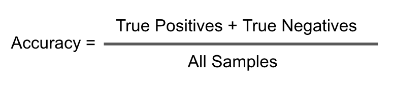

#### 1.3.3. Precision

Let’s use the same confusion matrix as the one we used before for our cancer detection example.
Precision is a measure that tells us what proportion of patients that we diagnosed as having malignant cancer, actually had  malignant cancer. The predicted positives (People predicted as malignant cancerous are TP and FP) and the people actually having a malignant cancer are TP.

    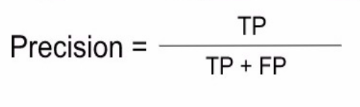

#### 1.3.4. Recall

Recall is a measure that tells us what proportion of patients that actually had malignant cancer was diagnosed by the algorithm as having malignant cancer. The actual positives (People having malignant cancer are TP and FN) and the people diagnosed by the model having a malignant cancer are TP. 

    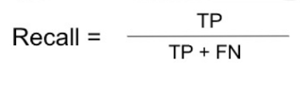

#### 1.3.5. F1 Score

The F1 score combines recall with precision so that they bring in a single number.

    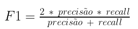

## 2. Analysis

### 2.1.  Data Exploration

#### 2.1.1.  Dataset

The dataset is from the University of California, Irvine, School of Information and Computer Sciences, and can be accessed through the link:
    
https://archive.ics.uci.edu/ml/datasets/Breast+Cancer+Wisconsin+%28Diagnostic%29

and on kaggle:

https://www.kaggle.com/uciml/breast-cancer-wisconsin-data

   The fine needle aspiration data set for breast lesions contains 569 samples of fine needle aspirate from breast nodules (FNAB), including 212 positive samples (malignancy) and 357 negative (benign) samples. All the samples were confirmed by biopsy.
    
Each sample contains the following information:

- 1) ID number
- 2) Diagnosis (M = malignant, B = benign)

Ten real-valued features are computed for each cell nucleus:

- a) radius (mean of distances from center to points on the perimeter)
- b) texture (standard deviation of gray-scale values)
- c) perimeter
- d) area
- e) smoothness (local variation in radius lengths)
- f) compactness (perimeter ^ 2 / area - 1.0)
- g) concavity (severity of concave portions of the contour)
- h) concave points (number of concave portions of the contour)
- i) symmetry
- j) fractal dimension ("coastline approximation" - 1)

The mean, standard error and "worst" or largest (mean of the three
largest values) of these features were computed for each image,
resulting in 30 features. For instance, field 3 is Mean Radius, field
13 is Radius SE, field 23 is Worst Radius.

    The dataset consists of a single file called data.csv, which contains the following columns:
    
- id                           
- diagnosis                    
- radius_mean                  
- texture_mean                 
- perimeter_mean               
- area_mean                    
- smoothness_mean              
- compactness_mean             
- concavity_mean               
- concave points_mean          
- symmetry_mean                
- fractal_dimension_mean       
- radius_se                    
- texture_se                   
- perimeter_se                 
- area_se                      
- smoothness_se                
- compactness_se               
- concavity_se                 
- concave points_se            
- symmetry_se                  
- fractal_dimension_se         
- radius_worst                 
- texture_worst                
- perimeter_worst              
- area_worst                   
- smoothness_worst             
- compactness_worst            
- concavity_worst              
- concave points_worst         
- symmetry_worst              
- fractal_dimension_worst   

    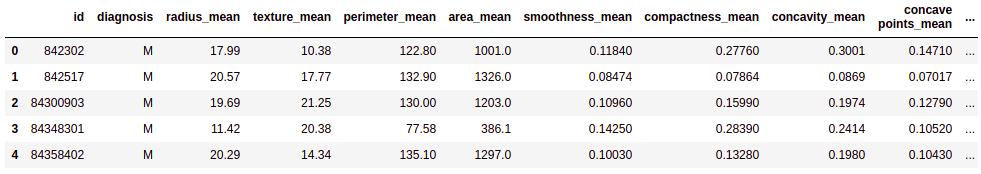

    
   It was checked for missing data, as can be seen in the heat map, there is none. But there is a column called "Unnamed: 32" that appeared, it was deleted, as well as the column "id" as it is not a relevant feature for model learning.
    

    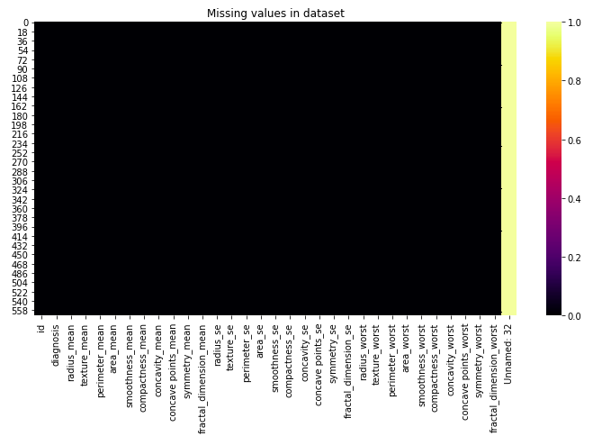

    
   

#### 2.1.1.  Statistics

With Pandas, a Python library, we can easily extract statistical information from numeric columns in a data set, to be able to make this statistic or "diagnosis" data has been transformed in integer, so that M = 0 and B = 1. To be able to view the table was divided into 4, once again we can see that there is no missing data.

    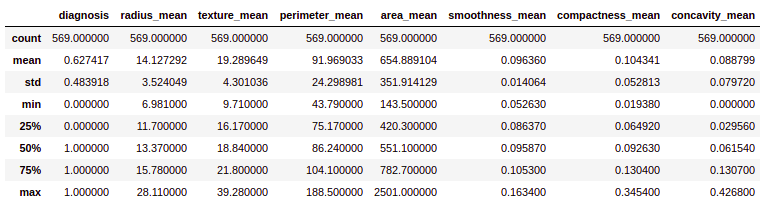

    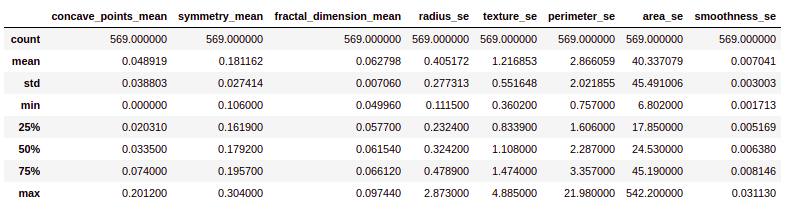

    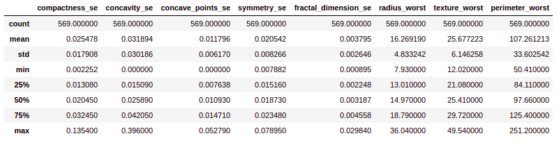

    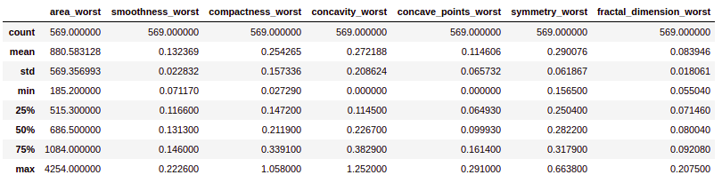

### 2.2. Exploratory Visualization

First it was observed that the dataset is unbalanced, there are more samples of benign than malignant cancer, as can be seen in the image below
    

    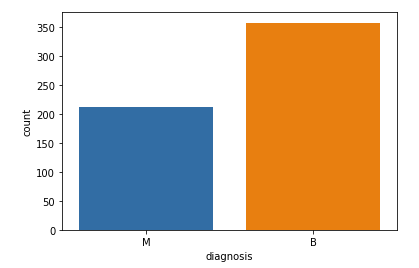

    
  Then the boxplot for each feature was plotted, separated by the classes of cancer, benign and malignant. It was observed that in most of the features there were expressive differences between the graphs of benign and malignant data. Before being plotted, the data had to be normalized, as the differences between the values ​​of the features are very high so that it would be difficult to visualize the data.
  
For normalization was the following expression used:
data = (data - data.mean ()) / (data.std ())

To facilitate the visualization, the data were grouped every 10, see the graphics:
   

Then the correlation map between the features was plotted, which gives a broader view of the variables. Due to the magnitude of the data it is a little difficult to see this map in an image.

    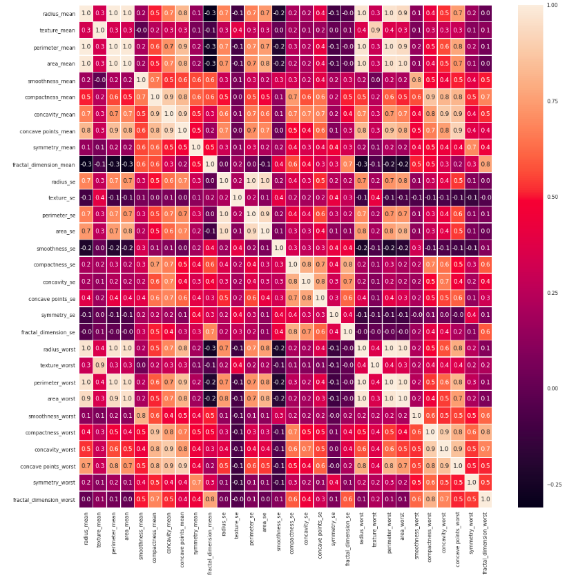

### 2.3.  Algorithms and Techniques

Scikit-Learn is a Python open source machine learning library that provides several data pre-processing algorithms, statistical estimator and metric scoring functions. This library will be widely used in the construction of models, k-fold and determination of metrics.

The models that will be used for the development of this project will be presented below.

#### 2.3.1.  SVM

A support vector machine (SVM) is a concept in computer science for a set of supervised learning methods that analyze data and recognize patterns, used for classification and regression analysis. The standard SVM takes a set of data as input and predicts, for each given input, which of two possible classes the input is part of, which makes SVM a non-probabilistic binary linear classifier. Given a set of training examples, each marked as belonging to one of two categories, an SVM training algorithm builds a model that assigns new examples to one category or another. An SVM model is a representation of examples as points in space, mapped so that the examples in each category are divided into a clear space that is as wide as possible. The new examples are then mapped into the same space and predicted to belong to a category based on which side of the space they are placed on.

#### 2.3.2.  Gradient Boosting Classifier

Gradient boosting is a machine learning technique for regression and classification problems, which produces a prediction model in the form of an ensemble of weak prediction models, typically decision trees. It builds the model in a stage-wise fashion like other boosting methods do, and it generalizes them by allowing optimization of an arbitrary differentiable loss function.

#### 2.3.3.  Stochastic Gradient Descent

The descent of the stochastic gradient (SGD usually abbreviated) is an iterative method to optimize an objective function with suitable smoothness properties (for example, differentiable or subdifferentiated). It can be considered a stochastic approximation of the gradient descent optimization, since it replaces the current gradient (calculated from the entire data set) with an estimate of it (calculated from a randomly selected subset). Especially in big data applications, this reduces the computational load, achieving faster iterations in commerce, for a slightly lower convergence rate.

#### 2.3.4.  Decision Tree

Decision tree learning is one of the predictive modeling approaches used in statistics, data mining and machine learning. It uses a decision tree (as a predictive model) to move from observations about an item (represented in the branches) to conclusions about the target value of the item (represented in the leaves). Tree models in which the target variable can receive a discrete set of values are called classification trees; in these tree structures, the leaves represent class labels and the branches represent sets of resources that lead to these class labels. Decision trees in which the target variable can take continuous values (usually real numbers) are called regression trees.

#### 2.3.5. Gaussian Naive Bayes

In machine learning, Bayes 'naive classifiers are a family of simple "probabilistic classifiers", based on the application of Bayes' theorem with strong (naive) assumptions of independence between resources. They are among the simplest Bayesian network models.

### 2.4.  Benchmark

To compare the performance of the developed models, academic articles will be used that solved the same problem with different techniques, they are and their metrics:

| Article | Technique | Accuracy (%)|
| --- | --- | --- |
| [1] | ACO-SVM  | 95.96 |
| [1] | GA-SVM  | 97.19 |
| [1] | PSO-SVM  | 97.37 |
| [2] | K-SVM  | 97.38 |

[1] Prasad, Y., Biswas, K., & Jain, C. (2010). Svm classifier based feature selection using
ga, aco and pso for sirna design. In Proceedings of the first international conference
on advances in swarm intelligence (pp. 307–314)

[2] Zheng, B., Yoon, S. W., & Lam, S. S. (2014). Breast cancer diagnosis based on feature extraction using a hybrid of K-means and support vector machine algorithms. Expert Systems with Applications, 41(4), 1476-1482.

## 3. Methodology

### 3.1.  Data Preprocessing

First columns that were useless or that did not represent relevant features were removed.
Then named columns with spaces were renamed and spaces removed.
Finally, the MinMaxScaler library was used to pre-process the data in order to facilitate the work of the machine learning models.

For each value in a resource, MinMaxScaler subtracts the minimum value in the resource and then divides it by the interval. The range is the difference between the original maximum and the original minimum.
MinMaxScaler preserves the shape of the original distribution. It does not significantly change the information incorporated in the original data.
Note that MinMaxScaler does not reduce the importance of outliers.
The range used for the resource returned by MinMaxScaler was 0 to 1.

The MinMaxScaler follows the following formula for each feature:

    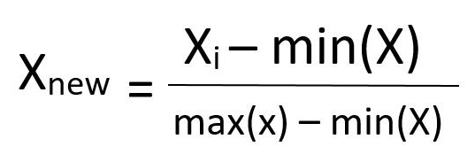

### 3.2.  Implementation

Five different classification models were implemented in order to find out which would be the best for this problem. All were implemented using the Scikit-Learn library, and all were left with their default values pre-defined by the library.

#### 3.2.1  K-fold

The central concept of cross-validation techniques is the partitioning of the data set into mutually exclusive subsets, and subsequently, the use of some of these subsets to estimate the model parameters (training data), with the remaining subsets (validation data test) used in the validation of the model.

The cross-validation method called k-fold consists of dividing the total data set into k mutually exclusive subsets of the same size and, from there, a subset is used for testing and the remaining k-1 are used for parameter estimation, making the model's accuracy calculation. This process is performed k times alternating the test subset in a circular fashion.
At the end of the k iterations, the accuracy of the errors found is calculated using the equation described above, thus obtaining a more reliable measure of the model's ability to represent the data generating process.

In this work, K-fold was used to verify the metrics of the models, k = 5 was used.

    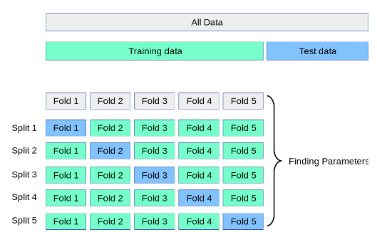

### 3.3.  Refinement

After training the models I tried to reduce the dimensionality of the data with PCA (Principal Component Analysis) before introducing them in the machine learning models, but I didn't get good results, the models showed better performances in the data just pre-processed.

## 4. Results

### 4.1. Model Evaluation and Validation

Metrics were obtained (average of k folds), for test and training data on all models, following the results of each model (remember M = 0 and B = 1):

#### 4.1.1 SVM

| Metric | Test | Train |
| --- | --- | --- |
| Accuracy | 98.24  | 98.28 |
| precision | 97.39  | 97.78 |
| Recall | 99.53 | 99.48 |
| F1 score | 98.43 | 98.62 |

    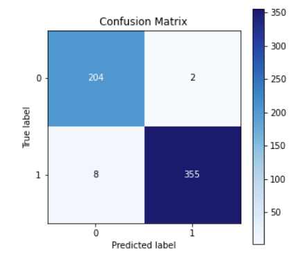

#### 4.1.1 Gradient Boosting Classifier

| Metric | Test | Train |
| --- | --- | --- |
| Accuracy | 95.08  | 1 |
| precision | 94.32  | 1 |
| Recall | 96.65 | 1 |
| F1 score | 95.39 | 1 |

    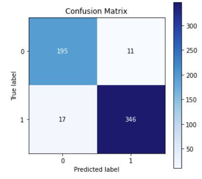

#### 4.1.1 Stochastic Gradient Descent

| Metric | Test | Train |
| --- | --- | --- |
| Accuracy | 96.83  | 97.18 |
| precision | 97.67  | 97.30 |
| Recall | 97.16 | 98.26 |
| F1 score | 97.34 | 97.75 |

    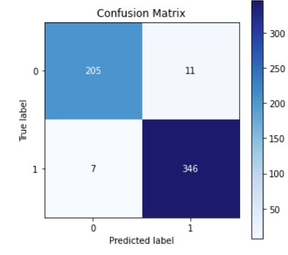

#### 4.1.1 Decision tree

| Metric | Test | Train |
| --- | --- | --- |
| Accuracy | 89.79  | 1 |
| precision | 91.57  | 1 |
| Recall | 91.11 | 1 |
| F1 score | 91.17 | 1 |

    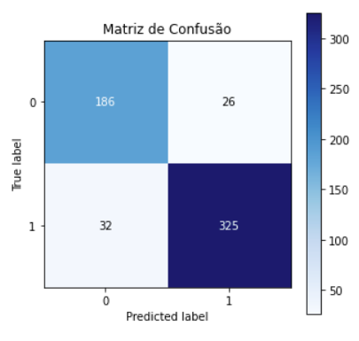

#### 4.1.1 Naive Bayes

| Metric | Test | Train |
| --- | --- | --- |
| Accuracy | 92.96  | 93.93 |
| precision | 92.65  | 94.07 |
| Recall | 94.99 | 96.34 |
| F1 score | 93.72 | 95.19 |

    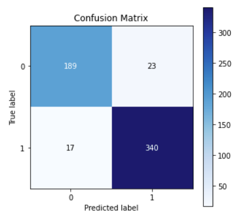

### 4.2. Justification

SVM stood out among the models, performing better in all the observed metrics and achieving an impressive 98.24% accuracy in the validation dataset.
Comparing with the benchmark models, the approach developed in this work showed better performance, at least with regard to accuracy, other metrics were not provided by the authors to be compared.
It can be said that the SVM model can solve the problem properly and with good accuracy.

